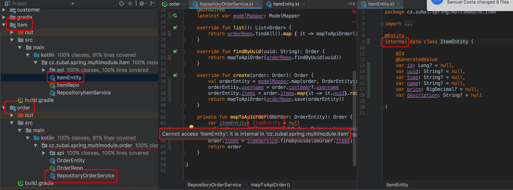

# Demo of module isolation with Spring-boot, Gradle and Kotlin 
This repository represents a very simple proof of concept of creating a **monolithic** **spring-boot** project with **separation** of internal components via Kotlin APIs (hiding their internals from others). This is done via utilising the **internal** Kotlin visibility modifier, which limits the visibility to the scope of the current module (which provides more isolation than Java's *package* protection - think of intentionally creating the same package as in your dependency to access it's package protected classes). The goal of this sample project is just to verify this works well with Spring and other libraries.

The APIs are very loosely coupled and it would be quite easy to change e.g. the persistence for each "service" or transform this to use microservices.

The project uses **spring-data** as a persistence layer for all the "services". It also takes advantage of **ObjectMapper** to reduce the boilerplate needed.

Following figure demonstrates the isolation by trying to use *ItemEntity* (internal to *item* module) in the *order* module:

